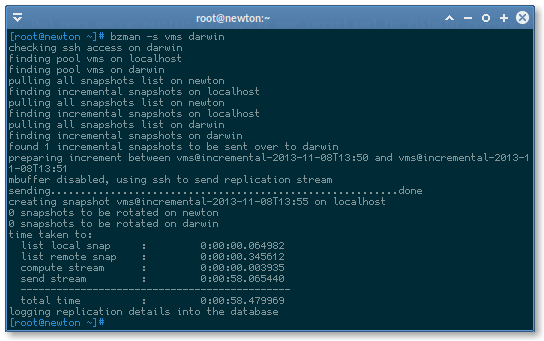
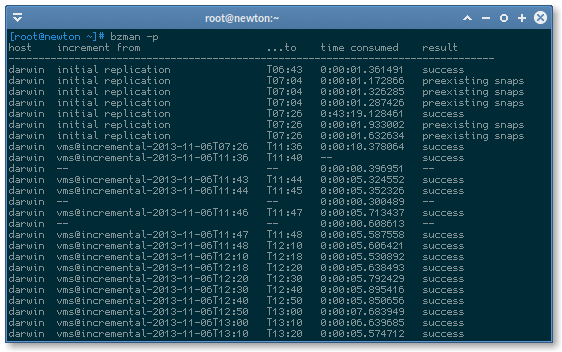
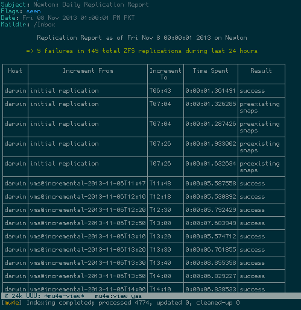

bzman
=====

Bassu's ZFS (replication) Manager
---------------------------------

### Why?

One of the main powerful features of ZFS is pool-wide incremental replication. That means you can maintain a hotcopy of your current pool for distaster recovery or for backup purposes. But since I didn't find any tool that reliably automated replication streams while keeping their record so I decided to write one.

Whatever may be the reason, you may want (or will have) a near-instant copy of your pool that is to least 10 minutes behind the original pool -- all the time.

*And that's what bzman is here for!*

On the plus side, it also monitors pool health status and usage capacity as well. 

### Features

- Keeps track of each replication in a serialized shelve database
- Nightly HTML reports
- Performs all sorts of preflight checks
- Automated full initial replication
- Outputs elasped times for all phases
- Logs to syslog as well as stdout
- Sends an instant email in case of error at any phase
- Lots of error handling (almost all)
- Uses optimized SSH for fast transfers (without compresssion, arcfour encryption)
- Ability to use mbuffer if needed

(Requires Python2.6+, tested on RHEL6)

### Screenshots

##### Replication

##### Printing Replication Events

##### HTML Report

### Help

	# bzman -h
	Usage: bzman [options]
	bzman - ZFS managing tool to monitor health, check free space, report,
	compute and send auto incremental ZFS pool replication streams
		                                                          
		Options:                                                  
		-m                  monitors health status of ZFS pools and
		                    sends error email if unhealthy
		                                                  
		-c                  checks free size of ZFS pools and
		                    sends an email if it's less than 25%
		                                                        
		-s [pool] [host]    sends datasets/zvols in ZFS [pool] to same
		                    [pool] on host via fast arcfour SSH or mbuffer
		                                                                  
		-p                  print the daily report of incremental snapshots
		                    streams, looks kinda like a replication log
		                                                               
		-r [to]             sends immediate daily report of incremental streams
		                    to [to] recipient
		                                     
		-h|--help           show this help menu
		                                       
		Defaults:                              
		- Error/report emails are sent to root (changeable in /etc/aliases).
		- Daily report is sent at midnight.                                 
		- Initial replication is automatic, destination pool with same name must exist.
		- All info and error messages are also logged to syslog.                       
		- Incremental backup time is assumed at 10 mins (cron to be setup with).
		- Snapshots are prefixed 'incremental' and kept for a week i.e. 3*24*7  
		- Destination pool name is chosen based on source pool name and will  
		  fail if it doesn't exit.

		  
### Bugs & Feature Requests
If you stumble upon a bug or have any feature requests, open up an issue. 